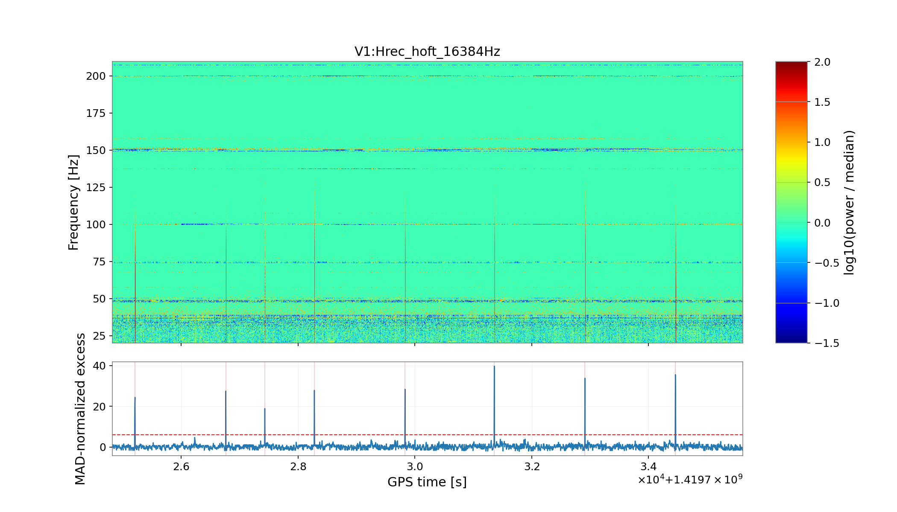
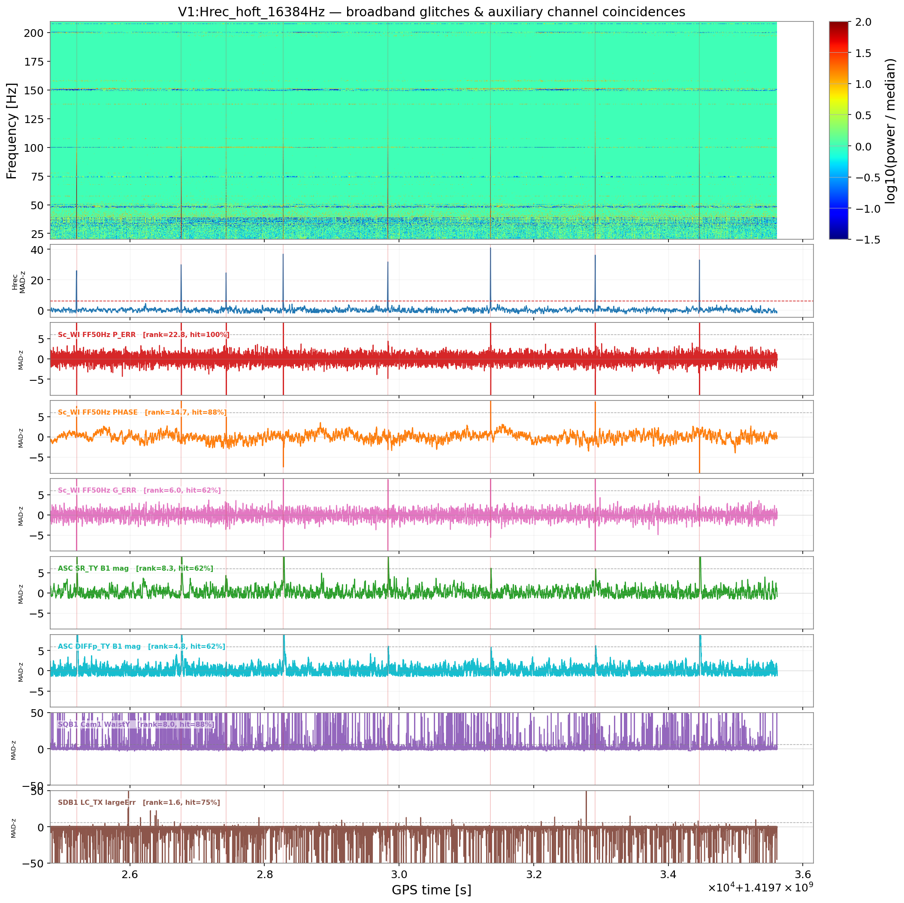
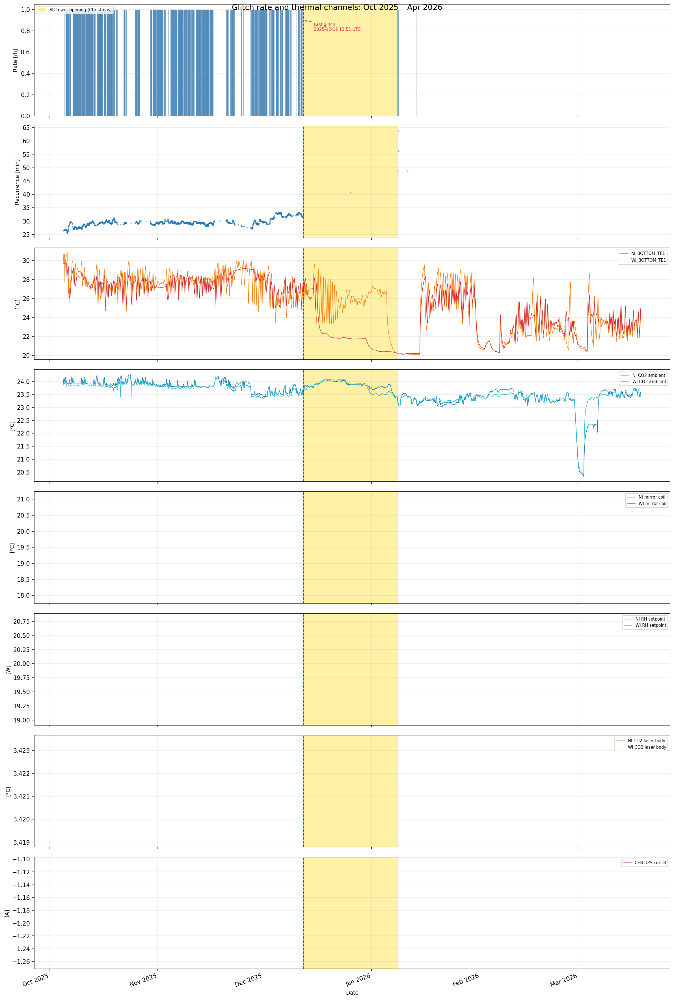
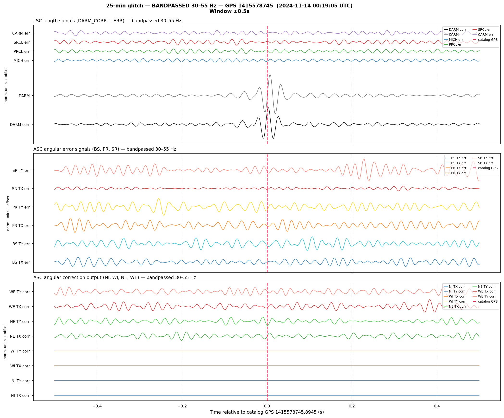
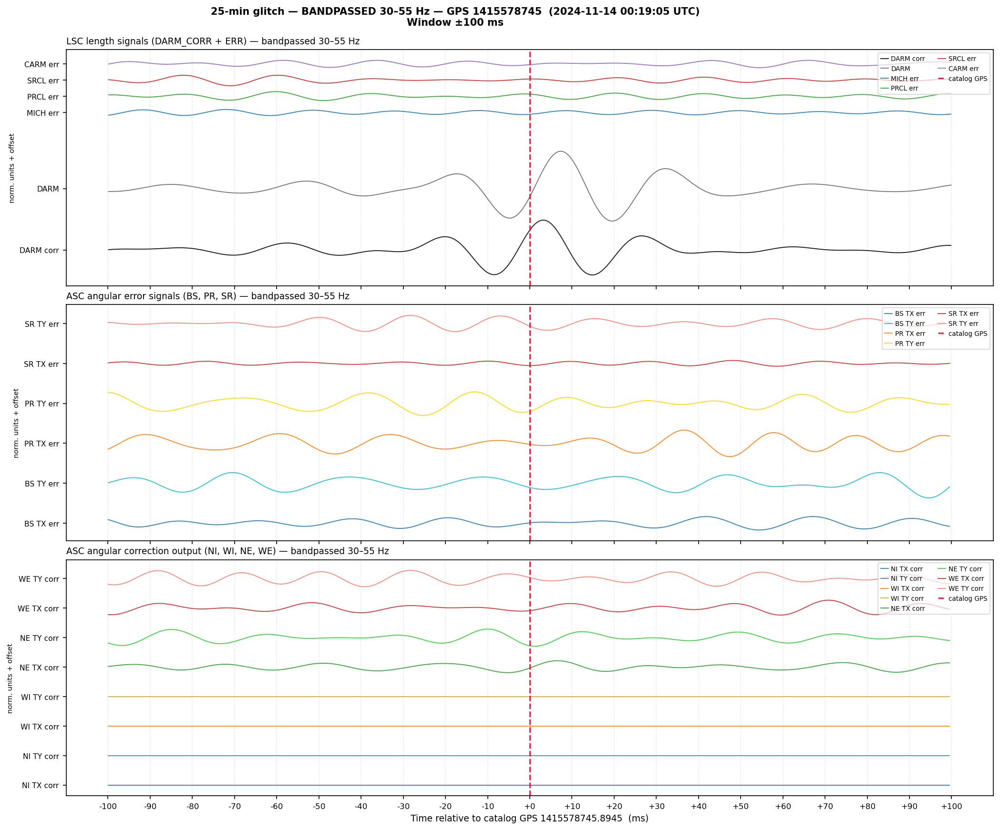
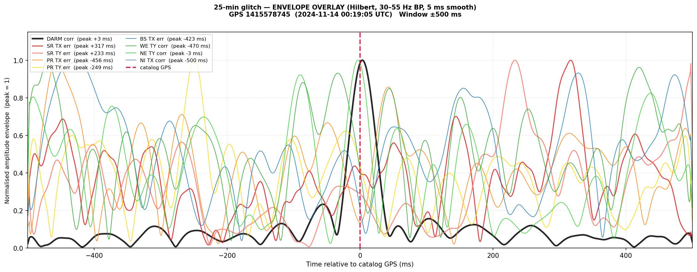
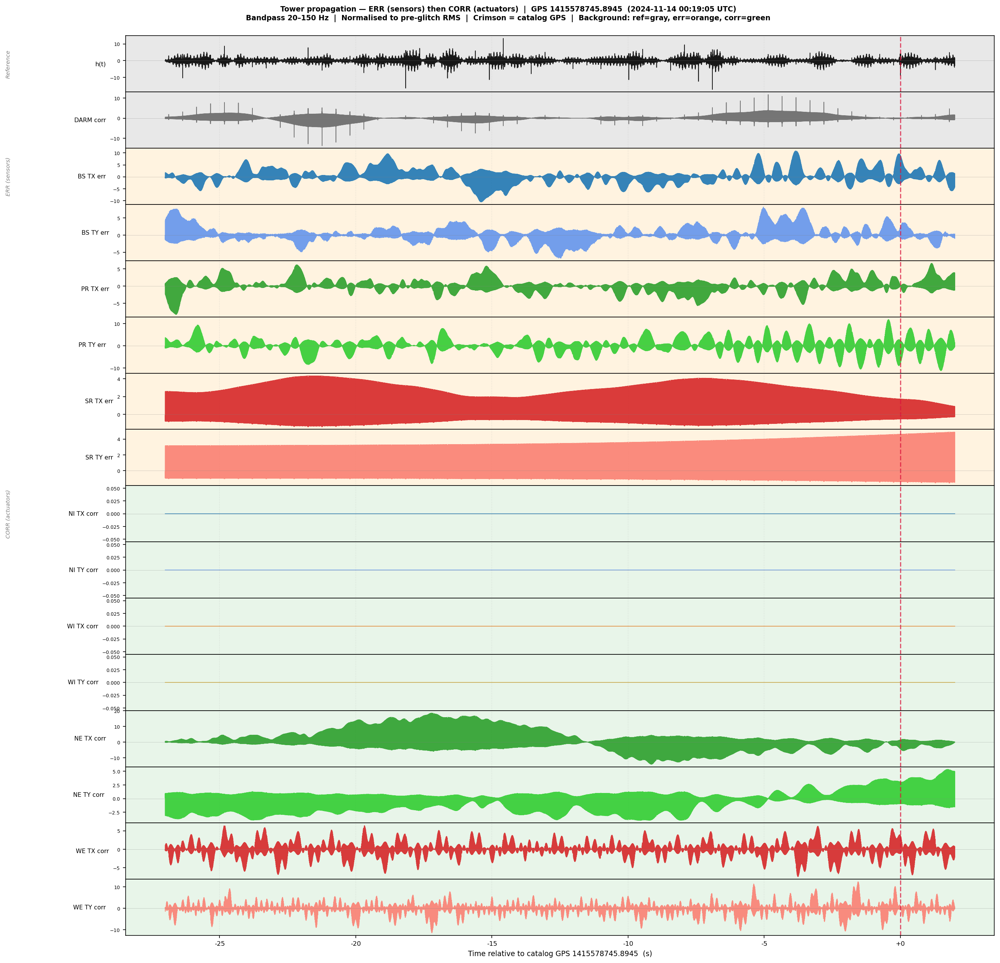
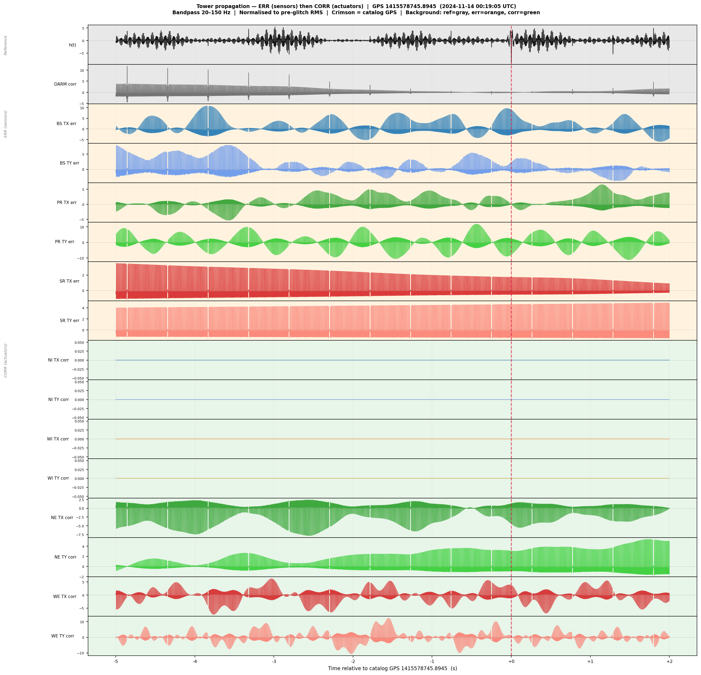
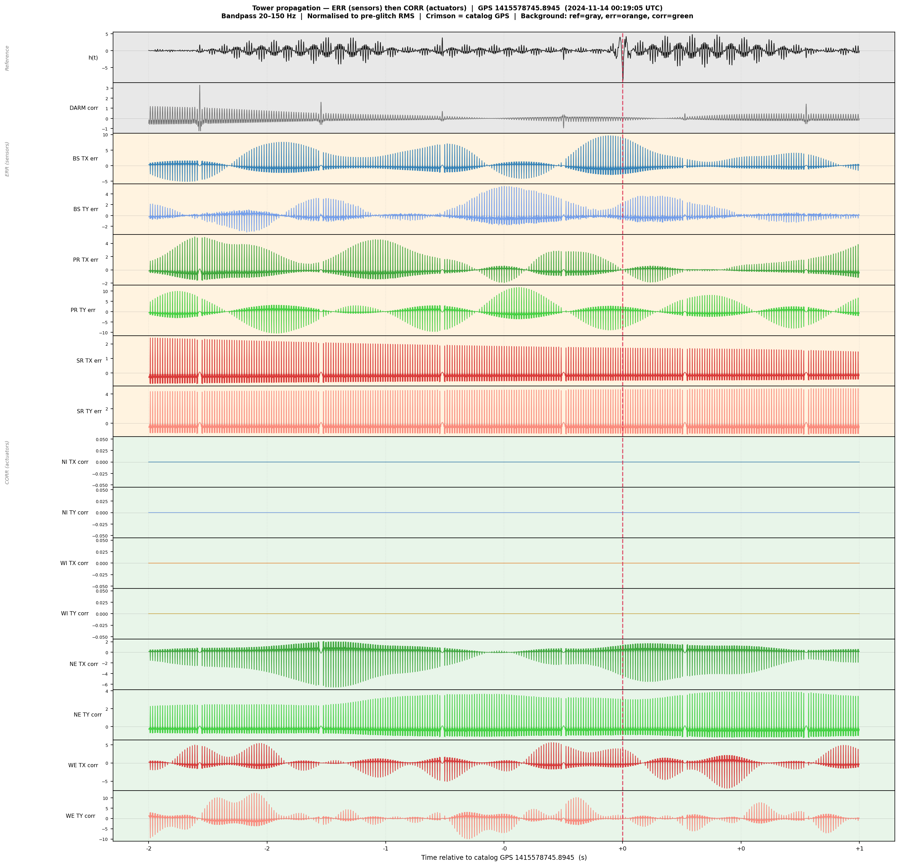

# 25-Minute Glitches — NOISEHOUND Investigation

## Introduction

The 25-minute glitches are a persistent family of broadband noise transients in the Virgo strain channel (Hrec_hoft): SNR ~400, peak frequency 40–50 Hz, recurrence interval ~25–32 min (seasonal). First documented before the O4b run start, they survived every hardware intervention through early 2026 and their origin remained unidentified until this investigation. Around March 2026 the BruCo online monitoring was disabled for this family as the glitches appear to have disappeared.

An independent cross-check is provided by the EXCAVATor tool (Swinkels, Nikhef), which ran on a 10-hour epoch in April 2023 (GPS 1366750818–1366786818, 26 triggers, 11 807 channels on 1 Hz trend). EXCAVATor independently confirms that LSC/DARM channels dominate (BPC_Y_COUPLING rank 1, IMC_LINE rank 2), fully consistent with the NOISEHOUND Jan 2025 ranking. Two additional pointers emerge from EXCAVATor not present in the NOISEHOUND top 20: (a) V1:ENV_CEB_UPS_CURR_R_mean (CEB UPS current, rank 15) — first per-event evidence for a CEB electrical coupling, consistent with the logbook suspicion; (b) V1:SBE_SNEB_GEO_GRWE_raw_mean (Suspended North End Bench geophone W-E, rank 5) and GRNS (rank 20) — seismic/mechanical activity at the North End bench correlates with the glitches. Both channels have been added to the slow-sensor rate-correlation campaign (Step 4), together with the SWEB counterparts as controls. The EXCAVATor report is in Appendix C.

This document reports the NOISEHOUND investigation. Section 2 summarises prior knowledge from the Virgo logbook. Section 3 outlines the investigation roadmap (Steps 1–7). Section 4 gives the detailed results for each step. The full logbook history is in Appendix A; trigger CSV files in Appendix B; the EXCAVATor cross-check in Appendix C.

---

## 2 — Background: prior knowledge from the Virgo logbook

### Physical characteristics

Recurring broadband glitches in Hrec_hoft with SNR ~400, peak frequency 40–50 Hz, recurrence interval ~1600 ± 60 s (~26 min). The interval varies seasonally: ~23 min in winter, up to ~32 min in summer. By late 2025 the interval had drifted to ~30 min and the family is sometimes called "30-minute glitches". The waveform is broadband and approximately symmetric, consistent with a step-like strain discontinuity. A residual 50 Hz tail appeared from mini-ER December 2023 onwards, attributed to feedforward subtraction.

### Established conclusions

Best correlator reported in the logbook: V1:INF_NI_BOTTOM_TE1 (NI tower bottom temperature), Pearson r = −0.72 with glitch *period* (logbook #66142, direnzo, Feb 2025) — significantly stronger than any mirror temperature channel. The seasonal variation of the recurrence period tracks ambient temperature and this channel. Source location is suspected near the North Input (NI) tower; the CEB area and UPS mains line have also been suspected. The NOISEHOUND full-baseline rate correlation (Step 4, Section 4.4) finds that the WI/NI CO2 bench ambient temperatures are the strongest statistical correlators over the full O4b dataset (|r| ~ 0.14–0.18), with NI_BOTTOM_TE1 at rank 7 (r = +0.074 at zero lag, peaking at r = +0.099 with a physically motivated +4 h lead time).

What is ruled out: NE mirror replacement, SWEB controls, SDB2_B1 channels (UPV analysis). V1:Sc_WI_FF50HZ_P_ERR is flagged 'Danger' in the ER16 channel safety study (#66923) — its correlation with the glitches is non-causal (feedforward reacting to the loud strain transient).

### Data quality impact

Glitches at SNR ~400 cause measurable drops in the BNS range when the PSD is estimated with a mean-based Welch method. Median-based estimators (e.g. gwistat) are robust against them.

See Appendix A for the full chronological logbook history.

---

## 3 — Investigation roadmap

### Step 1 — Trigger collection  [completed]

The full trigger catalog (ER16 + O4b, Apr 2023 – Jan 2026, 24 212 events) was provided by BruCo online monitoring. `noisehound detect` was additionally run on a short Hrec_hoft epoch (2025-01-01, GPS 1419724818–1419735618) to cross-check detection and validate the trigger times used for the ranking step. → Detailed results: Section 4.1; trigger files: Appendix B.

### Step 2 — Per-event NOISEHOUND ranking on 1 Hz trend data  [completed]

Applied the NOISEHOUND ranking pipeline to a 3-hour epoch on 2025-01-01 (GPS 1419724818–1419735618, 7 glitches, z-score 28–44). Extracted ±5 s windows from 9161 1 Hz trend channels; ranked by z-score, hit fraction, and cross-correlation lag. Result: LSC/DARM channels dominate (IMC line, PSTAB0, SIB1, lag +1.5–2 s). Top non-DARM channel Sc_WI_FF50HZ_P_ERR is non-causal (positive lag, 'Danger' flag). → Detailed results: Section 4.2.

### Step 3 — Causality analysis on the 3-hour epoch  [completed]

Three methods applied to the top 40 ranked channels: cross-correlation lag sign, Granger causality (VAR F-test), and Transfer Entropy (Schreiber 2000). All 40 channels show positive lag and TE direction ←hrec: strain drives auxiliary in every case. The ±5 s window is blind to the actual causal mechanism, which operates on thermal timescales. → Detailed results: Section 4.3.

### Step 4 — Glitch rate correlation with slow sensors over full O4b  [done]

Pearson and Spearman correlation of the hourly glitch rate against 33 slow channels over the full O4b dataset (Apr 2023 – Apr 2026, 25 512 one-hour bins, 12 879 bins with ≥1 trigger). A cross-correlation lag scan over ±7 days detects any thermal lead time. Channels were selected from three sources: (a) the Virgo logbook history of this glitch family, (b) physical reasoning about which slow sensors could modulate the thermal state of the input mirrors, and (c) the EXCAVATor per-event ranking (Appendix C). Top result: WI/NI CO2 bench ambient temperatures (|r| ~ 0.14–0.18); NI_BOTTOM_TE1 at rank 7 with a +4 h physical lag. → Detailed results: Section 4.4.

The 33 channels and their selection rationale:

| Channel (V1:...) | Description | Selection rationale / source |
|---|---|---|
| INF_NI_BOTTOM_TE1 | NI tower bottom temperature | Logbook #67414 (direnzo, Aug 2025): best known rate correlator, Pearson r=−0.72. Logbook #68210: remains best predictor after Sep 2025 CEB HVAC failure. |
| INF_WI_BOTTOM_TE1 | WI tower bottom temperature | WI counterpart; comparison with NI to localise the thermal source. |
| INF_NI_MIR_COIL_UL_TE | NI mirror coil upper-left temperature | INF thermometry close to NI suspension; tracks local heat load on mirror coil. |
| INF_WI_MIR_COIL_DR_TE | WI mirror coil down-right temperature | WI counterpart. |
| TCS_HWS_NI_TE1_mean | NI HWS bench thermistor 1 | Temperature of the NI Hartmann Wavefront Sensor optics bench; tracks thermal state of the NI TCS system. |
| TCS_HWS_NI_TE2_mean | NI HWS bench thermistor 2 | Second NI HWS thermistor for redundancy. |
| TCS_HWS_WI_TE1_mean | WI HWS bench thermistor 1 | WI counterpart. |
| TCS_HWS_WI_TE2_mean | WI HWS bench thermistor 2 | WI counterpart. |
| TCS_HWS_NE_TE1_mean | NE HWS bench thermistor (control) | North End bench, geographically remote from NI; serves as control channel. |
| ENV_TCS_CO2_NI_TE | NI CO2 bench ambient temperature | Ambient thermal environment of the NI CO2 laser bench. |
| TCS_NI_TE_CO2Laser | NI CO2 laser body temperature | Direct CO2 laser temperature; thermally coupled to output power stability. |
| ENV_TCS_CO2_WI_TE | WI CO2 bench ambient temperature | WI counterpart. |
| TCS_WI_TE_CO2Laser | WI CO2 laser body temperature | WI counterpart. |
| TCS_NI_CO2_PWRLAS_mean | NI CO2 laser output power | Power proxy for NI TCS actuation strength; complements the temperature channels. |
| INF_TCS_NI_RH_TE | NI ring heater thermistor temperature [°C] | Logbook #60143 (direnzo, May 2023): Pearson −40% with glitch distance series, first thermal correlator identified. Logbook #62992, #63147, #63310: confirmed strong correlator; etalon setpoint step of −0.3°C → +1'40" in glitch period. |
| INF_TCS_WI_RH_TE | WI ring heater thermistor temperature [°C] | WI counterpart to INF_TCS_NI_RH_TE. |
| ENV_CEB_N_TE | CEB north ambient temperature [°C] | Logbook #60143 and #66142: partially correlated with glitch rate but out of phase with NI_BOTTOM; proxy for CEB thermal environment. |
| LSC_Etalon_NI_RH_SET_mean | NI ring heater setpoint [W] | Ring heater is the primary slow thermal actuator on the NI input mirror; its setpoint tracks the required thermal correction. |
| LSC_Etalon_NI_RH_OUT_mean | NI ring heater output [W] | Actual delivered power; may differ from setpoint due to control saturation. |
| LSC_Etalon_NI_RH_IN_mean | NI ring heater input [W] | Input power monitor. |
| LSC_Etalon_NI_RH_ERR_mean | NI ring heater control error | Loop residual; tracks deviation of mirror temperature from thermal target. |
| LSC_Etalon_WI_RH_SET_mean | WI ring heater setpoint [W] | WI counterpart. |
| LSC_Etalon_WI_RH_OUT_mean | WI ring heater output [W] | WI counterpart. |
| LSC_Etalon_WI_RH_ERR_mean | WI ring heater control error | WI counterpart. |
| ENV_NEB_UPS_VOLT_R_mean | NEB UPS voltage phase R [V] | Mains voltage at NEB; logbook suspicion of UPS mains coupling to glitch rate. |
| ENV_CEB_UPS_VOLT_R_mean | CEB UPS voltage phase R [V] | CEB area mains voltage; CEB area suspected as source location in several logbook entries. |
| ENV_WEB_UPS_VOLT_R_mean | WEB UPS voltage phase R [V] | WEB mains voltage; control channel. |
| ENV_MCB_IPS_CURR_T_mean | MCB IPS current phase T [A] | Main control building current; proxy for overall mains electrical load. |
| ENV_CEB_UPS_CURR_R_mean | CEB UPS current phase R [A] | EXCAVATor per-event rank 15: first quantitative evidence of CEB electrical coupling. Added after EXCAVATor cross-check (Appendix C). |
| SBE_SNEB_GEO_GRWE_raw_mean | SNEB geophone W-E [counts] | EXCAVATor per-event rank 5: Suspended North End Bench geophone W-E; seismic/mechanical activity at SNEB correlates per-event with glitches. Added after EXCAVATor cross-check. |
| SBE_SNEB_GEO_GRNS_raw_mean | SNEB geophone N-S [counts] | EXCAVATor per-event rank 20: N-S component of SNEB seismic sensor. |
| SBE_SWEB_GEO_GRWE_raw_mean | SWEB geophone W-E [counts] | West End Bench counterpart; control channel (remote from NI). |
| SBE_SWEB_GEO_GRNS_raw_mean | SWEB geophone N-S [counts] | SWEB N-S control channel. |

### Step 5 — Lag refinement with 15-minute bins  [done]

Same 1 Hz trend GWFs as Step 4. The ~25-min glitch recurrence makes 15-minute bins degenerate (constant rate series → Pearson r undefined); lag refinement was instead performed by parabolic interpolation of the 1-hour cross-correlation peak on the four priority thermal channels. → Results: Section 4.5.

### Step 6 — Convergent Cross Mapping  [planned, if needed]

If Granger/TE remain inconclusive due to nonlinearity, CCM (Sugihara et al. 2012, Science 338:496) will be applied. → Results: Section 4.6.

### Step 7 — Control epoch: Oct 2025 – Apr 2026  [done]

Re-run the rate-correlation pipeline on the disappearance epoch (GPS 1443657600–1459468800) to cross-validate the thermal correlators and characterise the glitch dropout. Extracted from existing Step 4 merged data; no new SLURM jobs. → Results: Section 4.7.

### Step 8 — SR operating-point change after Christmas 2025  [done]

### Step 9 — Raw-data propagation study: which mirror is first affected?  [done]

Extract raw GWF data (100 s frames, ~4.5 GB each) around one pre-Christmas glitch event (GPS 1415578745, Nov 14 2024) and bandpass-filter (30–55 Hz) all ASC/LSC control signals at their native sample rates (4096 Hz for LSC, 2000 Hz for ASC). Compute the Hilbert amplitude envelope to determine which mirror's angular signal rises first relative to DARM. → Detailed results: Section 4.9.

Use the merged SR marionette and SR-TY input time series to test whether the disappearance is linked to the new SR geometry introduced during the Christmas 2025 shutdown. Importantly, the motivation for the SR baffle intervention was to enable operation in `LOW_NOISE_3_ALIGNED`, so the Christmas action must be treated as a coupled change of **hardware + accessible SR working point**, not as an isolated absorber replacement. Compare the stable pre-baffle window (Nov 24 – Dec 1, 2025) with the post-baffle window (Jan 14 – Mar 20, 2026), and check whether the old NI thermal conditions still occur after the glitch family vanishes. → Results: Section 4.8.

---

## 4 — Detailed results

### 4.1 — Step 1: trigger collection

The full trigger catalog (ER16 + O4b, 24 212 events) was provided by BruCo online monitoring. In addition, `noisehound detect` was run on a short Hrec_hoft epoch (2025-01-01, GPS 1419724818–1419735618) to cross-check the detection and validate the trigger times used for the ranking step.

See Appendix B for the full trigger CSV files.

### 4.2 — Step 2: per-event NOISEHOUND ranking

#### Run parameters

- Epoch: 2025-01-01, GPS 1419724818–1419735618 (3 hours)
- Glitches: 7, z-score range 28–44
- Channels ranked: 9161 (1 Hz trend)
- Window: ±5 s around each glitch peak

#### Top channels

| Channel | rank_score | median_z | hit_frac | lag (s) |
|---|---|---|---|---|
| V1:LSC_DARM_IMC_LINE_mag_100Hz_mean | 175.1 | 207.8 | 1.0 | +1.5 |
| V1:LSC_DARM_PSTAB0_COUPLING_100Hz_mean | 44.5 | 82.8 | 1.0 | +1.5 |
| V1:LSC_DARM_IMC_LINE_Q_100Hz_mean | 39.5 | 40.8 | 0.875 | +2.0 |
| V1:LSC_DARM_PSTAB0_I_FS_mean | 37.9 | 53.1 | 1.0 | +2.0 |
| V1:LSC_DARM_PSTAB0_I_100Hz_mean | 37.7 | 51.7 | 1.0 | +2.0 |
| V1:LSC_DARM_SIB1_LINE_mag_100Hz_mean | 31.8 | 44.9 | 1.0 | +1.5 |
| V1:Sc_WI_FF50HZ_P_ERR_mean | 22.8 | 36.2 | 1.0 | +1.0 |
| V1:LSC_DARM_SIB1_LINE_Q_100Hz_mean | 21.3 | 31.3 | 0.875 | +2.0 |
| V1:LSC_DARM_IMC_LINE_I_100Hz_mean | 20.6 | 27.3 | 1.0 | +1.0 |
| V1:Sc_WI_FF50HZ_PHASE_mean | 14.7 | 16.6 | 0.875 | +2.0 |
| V1:LSC_DARM_PSTAB0_Q_100Hz_mean | 11.1 | 32.3 | 1.0 | +2.0 |
| V1:LSC_DARM_PSTAB0_Q_FS_mean | 10.8 | 31.1 | 1.0 | +2.0 |
| V1:ASC_SR_TY_DCP_mag_B1_mag_10Hz_FS_mean | 8.3 | 8.2 | 0.625 | +5.0 |
| V1:LSC_DARM_BPC_TY_COUPLING_100Hz_mean | 8.1 | 18.9 | 0.875 | +1.5 |
| V1:SQB1_Cam1_FitWaistY_mean | 8.0 | 126.4 | 0.875 | +2.0 |
| V1:LSC_DARM_BPC_Y_COUPLING_100Hz_mean | 7.4 | 27.1 | 1.0 | +1.5 |
| V1:Sc_WI_FF50HZ_G_ERR_mean | 6.0 | 17.7 | 0.625 | +1.0 |
| V1:LSC_DARM_SIB1_LINE_I_100Hz_mean | 5.2 | 16.0 | 0.625 | +1.5 |
| V1:ASC_DIFFp_TY_DCP_mag_B1_mag_10Hz_FS_mean | 4.8 | 7.8 | 0.625 | +5.0 |
| V1:LSC_DARM_BPC_TX_COUPLING_100Hz_mean | 3.6 | 11.1 | 0.875 | +1.5 |

#### Top subsystems

| Subsystem | max rank_score |
|---|---|
| LSC | 175.1 |
| ASC | 8.3 |
| SQB1 (squeezing bench camera) | 8.0 |
| FCEB | 2.2 |
| SDB1 / SDB2 | 1.6 |
| SPRB | 1.5 |
| SNEB | 1.5 |
| EQB1 | 0.9 |
| PSL | 0.8 |

#### Key findings

All top-ranked channels belong to LSC/DARM control loops, with positive lags of +1.5–2 s (strain leads auxiliary). The top non-DARM channel (Sc_WI_FF50HZ_P_ERR) carries a 'Danger' flag and is confirmed non-causal (feedforward reacting to the loud strain transient). No slow environmental or thermal channel ranks in the top 40 — consistent with a causal mechanism operating on timescales much longer than the ±5 s ranking window.

### 4.3 — Step 3: causality analysis

All 40 top-ranked channels were tested with three methods over the same 3-hour epoch (GPS 1419724818–1419735618):

- **Cross-correlation lag**: positive lag for all 40 channels (strain leads auxiliary by 1–5 s). A negative lag would be required for any causal candidate; none found.

- **Granger causality** (VAR model, lag order selected by AIC, F-test): the direction hrec→aux is significant at p < 0.001 for all channels tested, including ASC_SR_TY (p = 0.000). The reverse direction (aux→hrec) is not significant.

- **Transfer entropy** (Schreiber 2000, histogram MI estimator, 5-bin): TE(hrec→aux) > TE(aux→hrec) for all 40 channels. The net information flow is from strain to auxiliary in every case. No channel shows a causal signature within the ±5 s event window.

**Overall conclusion**: the per-event ranking approach correctly identifies channels that couple to the glitch, but cannot identify its origin because the causal mechanism operates on timescales much longer than the ±5 s window.

### 4.4 — Step 4: glitch rate correlation

**Dataset**: 25 512 hourly bins, Apr 2023 – Apr 2026; 12 879 bins with ≥1 trigger (50.5% duty cycle). 33 slow channels from 1 Hz trend GWF files staged from HPSS.

#### Correlation table (zero-lag, Pearson r, n = 12 879 bins with triggers)

| Rank | Channel | Description | Pearson r | Spearman r | Notes |
|------|---------|-------------|-----------|------------|-------|
| 1 | V1:ENV_TCS_CO2_WI_TE | WI CO2 bench ambient [°C] | −0.175 | −0.170 | Zero-lag peak; rate leads temp by ~1 h |
| 2 | V1:ENV_TCS_CO2_NI_TE | NI CO2 bench ambient [°C] | −0.137 | −0.143 | Same |
| 3 | V1:ENV_CEB_UPS_CURR_R_mean | CEB UPS current R [A] | +0.123 | +0.119 | EXCAVATor rank 15 confirmed |
| 4 | V1:TCS_WI_TE_CO2Laser | WI CO2 laser body [°C] | +0.101 | +0.093 | |
| 5 | V1:TCS_NI_TE_CO2Laser | NI CO2 laser body [°C] | −0.100 | −0.099 | |
| 6 | V1:INF_WI_MIR_COIL_DR_TE | WI mirror coil TE [°C] | −0.086 | −0.072 | |
| 7 | V1:INF_NI_BOTTOM_TE1 ★ | NI tower bottom TE1 [°C] | +0.074 | +0.057 | Logbook champion; peaks r=+0.099 at +4 h lag |
| 8 | V1:LSC_Etalon_WI_RH_SET_mean | WI ring heater setpoint [W] | −0.074 | −0.081 | |
| 9 | V1:INF_NI_MIR_COIL_UL_TE | NI mirror coil TE [°C] | −0.063 | −0.067 | |
| 10 | V1:INF_TCS_WI_RH_TE | WI ring heater thermistor [°C] | −0.078 | −0.062 | |
| 11 | V1:ENV_CEB_N_TE | CEB north ambient temp [°C] | −0.048 | −0.107 | |
| 12 | V1:INF_TCS_NI_RH_TE | NI ring heater thermistor [°C] | −0.035 | −0.043 | |
| 13 | V1:INF_WI_BOTTOM_TE1 | WI tower bottom TE1 [°C] | +0.037 | +0.028 | WI counterpart to NI_BOTTOM_TE1; weaker |
| 14–33 | — | Electrical, geophones, other RH channels | \|r\| < 0.05 | | |

#### Lag scan

Physically meaningful lags (< 10 h, sensor leads glitch rate):

| Channel | Description | Best lag | Best r |
|---------|-------------|----------|--------|
| V1:INF_NI_BOTTOM_TE1 | NI tower bottom TE1 | **+4 h** | +0.099 |
| V1:ENV_TCS_CO2_WI_TE | WI CO2 bench ambient | −1 h | −0.183 |
| V1:ENV_TCS_CO2_NI_TE | NI CO2 bench ambient | −1 h | −0.145 |

All other channels with apparent best lags > 100 h (WI CO2 laser at +165 h, CEB UPS current at +166 h, mirror coils at ±163 h, etc.) are driven by seasonal co-variation and are not physically interpretable as causal leads.

#### Key findings

1. **CO2 bench ambient temperatures are the strongest correlators** (|r| ~ 0.14–0.18), not INF_NI_BOTTOM_TE1. Their near-zero lag (−1 h) means glitch rate and CO2 bench temperature respond to the same slow forcing on roughly the same timescale — both proxy the same underlying thermal state.

2. **NI_BOTTOM_TE1 shows a physically consistent lag of +4 h** (sensor leads rate, r = +0.099 at peak). This is compatible with the logbook narrative: tower-bottom temperature accumulates thermal energy that drives the glitch mechanism ~4 h later. The zero-lag r = +0.074 is positive, consistent with the logbook's r = −0.72 sign once the metric is converted (logbook measured temperature vs inter-glitch period; period ∝ 1/rate, so negative r(period, T) → positive r(rate, T)). The magnitude difference (0.074 vs 0.72) reflects the contrast between a targeted 2-week episode and the full 3-year baseline with intermittent glitch activity.

3. **CEB electrical (UPS current, r = +0.123) is the third-strongest correlator** — consistent with EXCAVATor's per-event ranking of this channel at rank 15. However, its lag scan peaks at +166 h, which is seasonal and not causal. The zero-lag signal is real but moderate.

4. **Ring heater thermistors and CEB ambient temperature are weak correlators** (|r| < 0.08). Despite logbook reports of 40% correlation in specific episodes (Logbook #60143), the long-baseline correlation is diluted, consistent with the etalon setpoint being an *actuation* channel (it changes in response to the glitch-driving thermal state, not the cause of it).

5. **Geophones (SNEB, SWEB) show negligible correlation** (|r| < 0.026), ruling out seismic/mechanical coupling as a rate driver at hourly timescales despite EXCAVATor flagging them per-event.

**Step 5 priority channels**: V1:INF_NI_BOTTOM_TE1 (+4 h lag, physically motivated), V1:ENV_TCS_CO2_WI_TE and V1:ENV_TCS_CO2_NI_TE (strongest correlators, near-zero lag requires sub-hour characterisation). Also V1:INF_WI_BOTTOM_TE1 as NI counterpart control.

### 4.5 — Step 5: lag refinement  [done]

The ~25-min glitch recurrence period makes 15-minute bins degenerate (most non-zero bins contain exactly one trigger, giving a near-constant rate series of 4/h → Pearson r undefined). Lag refinement was therefore performed by parabolic interpolation of the 1-hour cross-correlation peak: a parabola is fitted to the three-point neighbourhood of the integer-lag maximum, applied to bins with rate > 0. This refines the 1-hour-resolution lag to sub-hour precision without additional SLURM jobs.

Four priority channels (V1:INF_NI_BOTTOM_TE1, V1:INF_WI_BOTTOM_TE1, V1:ENV_TCS_CO2_NI_TE, V1:ENV_TCS_CO2_WI_TE):

| Channel | Description | Integer lag | Refined lag | Peak r |
|---------|-------------|-------------|-------------|--------|
| V1:INF_NI_BOTTOM_TE1 | NI tower bottom TE1 | +4 h | **+4.16 h (+4 h 10 min)** | +0.099 |
| V1:ENV_TCS_CO2_WI_TE | WI CO2 bench ambient | −1 h | **−0.94 h (−56 min)** | −0.183 |
| V1:ENV_TCS_CO2_NI_TE | NI CO2 bench ambient | −1 h | **−0.93 h (−56 min)** | −0.145 |
| V1:INF_WI_BOTTOM_TE1 | WI tower bottom TE1 | — | no significant peak | — |

**Interpretation**: The CO2 bench ambient channels peak at −0.94/−0.93 h (rate leads temperature by ~56 min), consistent with both being driven by the same slow ambient thermal forcing on similar timescales. NI_BOTTOM_TE1 peaks at +4.16 h (sensor leads rate by ~4 h), consistent with the logbook narrative of tower-bottom temperature accumulating heat that drives the glitch mechanism several hours later. WI_BOTTOM_TE1 shows no significant lag peak, confirming the asymmetry between NI and WI already visible in the zero-lag correlation table.

### 4.6 — Step 6: Convergent Cross Mapping  [pending Step 4]

To be performed if Granger/TE results in Step 4 are inconclusive.

### 4.7 — Step 7: control epoch (Oct 2025 – Apr 2026)  [done]

**Dataset**: GPS 1443657600–1459468800 (Oct 2025 – Apr 2026), extracted from the existing Step 4 merged data. 3912 hourly bins total; 1059 bins with ≥1 trigger (glitches disappear ~Jan 2026, logbook #68511). The `rate > 0` filter retains only the pre-disappearance glitchy period for correlation.

#### Correlation table (zero-lag, Pearson r, n = 1059 bins with triggers)

| Rank | Channel | Description | Pearson r | Spearman r | Notes |
|------|---------|-------------|-----------|------------|-------|
| 1 | V1:INF_WI_MIR_COIL_DR_TE | WI mirror coil TE [°C] | +0.207 | +0.159 | Step 4 rank 6 (r=−0.086); sign flipped, now strongest |
| 2 | V1:INF_NI_MIR_COIL_UL_TE | NI mirror coil TE [°C] | +0.183 | +0.081 | Step 4 rank 9 (r=−0.063); same flip |
| 3 | V1:LSC_Etalon_WI_RH_SET_mean | WI ring heater setpoint [W] | +0.172 | +0.150 | Step 4 rank 8 (r=−0.074); sign flipped |
| 4 | V1:LSC_Etalon_NI_RH_SET_mean | NI ring heater setpoint [W] | +0.172 | +0.150 | Step 4 rank 12 (r=−0.035); sign flipped |
| 5 | V1:TCS_NI_CO2_PWRLAS_mean | NI CO2 laser power [W] | +0.166 | +0.138 | |
| 6 | V1:LSC_Etalon_NI_RH_IN_mean | NI ring heater input [W] | −0.146 | −0.111 | |
| 7 | V1:INF_NI_BOTTOM_TE1 ★ | NI tower bottom TE1 [°C] | +0.131 | +0.093 | Consistent with Step 4; lag refined to +3.3 h |
| 8 | V1:INF_WI_BOTTOM_TE1 | WI tower bottom TE1 [°C] | +0.130 | +0.088 | Stronger than in Step 4 (r=+0.037) |
| — | V1:ENV_TCS_CO2_WI_TE | WI CO2 bench ambient [°C] | +0.044 | +0.037 | Step 4 rank 1 (r=−0.175); nearly zero and sign-flipped |
| — | V1:ENV_TCS_CO2_NI_TE | NI CO2 bench ambient [°C] | +0.035 | +0.015 | Step 4 rank 2 (r=−0.137); same |
| — | V1:TCS_WI_TE_CO2Laser / V1:TCS_NI_TE_CO2Laser | CO2 laser body [°C] | NaN | NaN | Channel flat or unavailable in this epoch |

#### Key findings

1. **CO2 bench ambient temperatures collapse to near-zero correlation** in the final epoch (r ~ +0.04 vs r ~ −0.18 over the full baseline). Their dominant role in Step 4 was driven by slow seasonal co-variation with the glitch rate over the full 3-year dataset, not by a direct physical coupling. This is a negative-control confirmation.

2. **Mirror coil temperatures and ring heater setpoints become the leading correlators** (r ~ 0.17–0.21). The sign flip relative to Step 4 suggests the thermal state of the mirrors in this final period differs from the long-term baseline trend (winter 2025–2026 vs the full O4b mean).

3. **NI_BOTTOM_TE1 remains consistently correlated** (r = +0.131, lag ~3 h) across both the full baseline and the final epoch — the only channel stable across both analyses. This reinforces it as the most physically relevant thermal correlator.

4. **CO2 laser body temperatures are unavailable** (flat channel) in this epoch, explaining the NaN.

5. **The disappearance itself** is visible in the time-series plot below. The vertical red dashed line marks the last trigger before a 27-day gap (2025-12-12, computed from the trigger catalog), which is the data-derived disappearance time. NI_BOTTOM_TE1 drops by ~8°C precisely at this marker. The CO2 bench ambient temperatures drop sharply only in February–March 2026, weeks *after* the glitches are gone — confirming they were not driving the disappearance. Mirror coil temperatures show isolated spikes but no coherent transition at the dropout.

The **yellow band** marks the ITF shutdown period (Christmas maintenance, 2025-12-12 – 2026-01-08, 27 days). It is derived directly from the trigger catalog: the last trigger before the gap falls at GPS 1449582668 (2025-12-12) and the first trigger after the gap at GPS 1451908330 (2026-01-08). The vertical red dashed line marks the last trigger. The plot is generated by `scripts/plot_disappearance_timeseries.py`.

**The NI_BOTTOM_TE1 drop at the disappearance is the strongest evidence yet for a direct thermal link**: the channel that was the most stable correlator across both the full baseline and the final epoch dropped abruptly at the moment the glitches stopped, while the seasonally-dominant CO2 bench channels lagged by weeks. The ITF relock after the Christmas shutdown (Jan 8, 2026) did not coincide with a return of the glitches, confirming that whatever had been driving them was not restored by the relock alone.

### 4.8 — Step 8: SR operating-point change after Christmas 2025

Three existing plots (`sr_mar_tx_timeseries.png`, `sr_ty_input_timeseries.png`, `glitch_vs_sr_tx.png`) were re-read together with the merged CSVs (`sr_o4_merged.csv`, `sr_ty_input_merged.csv`, `ni_thermal_merged.csv`) to test the SR-baffle hypothesis more directly. A compact, reproducible text report is generated by `scripts/summarize_sr_operating_point.py`.

#### Key observation: the SR operating point changed drastically across the Christmas shutdown

In the clean pre-baffle comparison window (2025-11-24 to 2025-12-01), stable `LOW_NOISE_3` sits at:

- `SAT_SR_MAR_TX_SET` median = **+7.33**
- `ASC_SR_TY_INPUT` median = **189.98**
- `INF_NI_BOTTOM_TE1` median = **27.29°C**
- glitch rate = **198 glitches / 98 h = 2.02/h**

In the post-baffle comparison window (2026-01-14 to 2026-03-20), the interferometer never returns to that SR regime:

- `LOW_NOISE_3`: only **2 h**, `TX = -758.7`, `TY_INPUT = 0.13`, **0 glitches**
- `LOW_NOISE_3_ALIGNED`: **315 h**, `TX = -805.7`, `TY_INPUT ≈ 0`, **0 glitches**
- `LOW_NOISE_2`: **100 h**, `TX = -758.7`, `TY_INPUT ≈ 0`, **0 glitches**

So the post-Christmas detector is not simply “the same optical state but with a new baffle”: it is running in a **different SR angular operating point**. This is consistent with the commissioning motivation of the Christmas intervention itself, namely to make operation in `LN3_ALIGNED` with the SR feasible.

#### Follow-up exact lock-point comparison from CCA narrow pulls

To test the qualitative statements of commissioning entry **#68458** directly, a narrow extractor (`slurm/nh_lockpoint_compare_extract.slurm`) was run on CCA on the exact trend channels:

- `V1:LSC_B1p_DC_mean`
- `V1:DET_B1p_DC_mean`
- `V1:LSC_B4_112MHz_MAG_mean`
- `V1:SPRB_B4_QD2_UL_112MHz_mag_FS_mean`
- `V1:LSC_MICH_SET_TOT`
- `V1:LSC_SRCL_SET_TOT`

Stable-state medians are:

- **Oct 12, 2025** (`LN3`): `b1p_dc = 0.00740`, `B4_112MHz = 0.02630`, `MICH_SET_TOT = 13.34`, `SRCL_SET_TOT = 53.82`
- **Dec 11, 2025** (`LN2/LN3`): `b1p_dc = 0.01111`, `B4_112MHz = 0.02156`, `MICH_SET_TOT = 51.18`, `SRCL_SET_TOT = 19.20`
- **Jan 8, 2026** (`LN2/LN3`): `b1p_dc = 0.01648`, `B4_112MHz = 0.02461`, `MICH_SET_TOT = 8.73`, `SRCL_SET_TOT = 25.07`
- **Jan 14–29, 2026** (`LN2/LN3/LN3_ALIGNED`): `b1p_dc = 0.01937`, `B4_112MHz = 0.02394`, `MICH_SET_TOT = 22.37`, `SRCL_SET_TOT = 3.76`

This gives three strong results:

1. The exact **112 MHz sideband level** on **Jan 8** is indeed **between October and December** (`0.02461`, versus `0.02630` in October and `0.02156` in December), matching the qualitative commissioning statement.
2. The exact **MICH set** also matches the commissioning claim: `MICH_SET_TOT` is **much lower than December** on Jan 8 (`8.73` versus `51.18`), and much closer to October (`13.34`) than to December.
3. The exact **SRCL set** likewise matches the commissioning claim: `SRCL_SET_TOT` on Jan 8 (`25.07`) is **lower than October** (`53.82`) but **higher than December** (`19.20`).

The one point that does **not** reproduce cleanly is the statement that “**B1p DC is back to the October level**.” With the exact trend channels extracted here (`LSC_B1p_DC_mean`, `DET_B1p_DC_mean`), the Jan 8 values are *higher* than both October and December. Splitting Jan 8 by state helps a bit: the two `LN3` hours give `b1p_dc = 0.00968`, i.e. between October and December, while the six `LN2` hours give `0.01663`. So either the entry was referring to a slightly different B1p-DC observable, or it was visually comparing a specific final-lock slice rather than the full day median. This ambiguity does **not** affect the MICH/SRCL conclusion.

The most important new point is that the **stable glitch-free post-Jan-14 detector** is not simply “Jan 8 recovered”: it moves again to a very different exact LSC working point, especially in `SRCL_SET_TOT`, which falls to **3.76**. So the disappearance is associated not only with the SR angular jump (`TX`, `TY_INPUT`), but also with a real reorganisation of the longitudinal operating point.

#### NI thermal state still reaches the old glitch-friendly range after January 14, 2026

This is the strongest argument against a pure “the NI thermal driver itself disappeared” interpretation.

For science-like post-2026-01-14 states (`LN2`, `LN3`, `LN3_ALIGNED`):

- `INF_NI_BOTTOM_TE1 >= 24°C`: **223 h**, **0 glitches**
- `INF_NI_BOTTOM_TE1 >= 25°C`: **185 h**, **0 glitches**
- `INF_NI_BOTTOM_TE1 >= 26°C`: **134 h**, **0 glitches**
- `INF_NI_BOTTOM_TE1 >= 27°C`: **91 h**, **0 glitches**

By contrast, pre-Christmas `LOW_NOISE_3` at the same thresholds gives:

- `INF_NI_BOTTOM_TE1 >= 24°C`: **5865 h**, **11557 glitches**, **1.97/h**
- `INF_NI_BOTTOM_TE1 >= 25°C`: **4912 h**, **9747 glitches**, **1.98/h**
- `INF_NI_BOTTOM_TE1 >= 26°C`: **3869 h**, **7736 glitches**, **2.00/h**
- `INF_NI_BOTTOM_TE1 >= 27°C`: **3029 h**, **6062 glitches**, **2.00/h**

The old NI-bottom temperatures therefore remain **necessary-looking but no longer sufficient** once the SR operating point changes.

#### Residual triggers after the shutdown are sparse and mostly transitional

After deduplicating the trigger catalogue (`Δt > 300 s`), only **6** post-gap events remain after **2025-12-12 13:51 UTC**. Of these, only **3** look morphologically consistent with the historical 25-minute family (`q < 10`, `35 < f < 55 Hz`):

- 2026-01-08 11:52 UTC, `SNR = 308`, `f = 40.4 Hz`, `TX = -747`, `TY_INPUT = 171`
- 2026-01-08 17:52 UTC, `SNR = 226`, `f = 47.8 Hz`, `TX = -746.9`, `TY_INPUT ≈ 0`
- 2026-01-08 19:34 UTC, `SNR = 105`, `f = 47.8 Hz`, `TX = -747`, `TY_INPUT ≈ 0`

No canonical event remains after the first relock day, and the isolated **2026-01-13** catalogue entry is likely contamination from another family (`f = 26.5 Hz`, `q = 72`).

#### What changed in SR is unusually large

Earlier O4 SR-TX steps of **15–55 units** did not kill the family; the glitches survived them. The largest detected step is at **2026-01-07 08:00 UTC**:

- `SAT_SR_MAR_TX_SET`: **+2.52 -> -164.09** (`ΔTX = -166.6`)

This is followed by the new post-shutdown regime at approximately **-747** on **2026-01-08**, and later by another move to approximately **-806** in February 2026. The Christmas intervention is therefore unique not because *some* SR step happened, but because the detector moved into a **new, previously unseen SR geometry family** and never came back.

#### Interpretation

1. **Two-stage model now looks more plausible than a single-source model**: a slow thermal process near NI still appears to modulate the preferred recurrence period, but the visibility of that disturbance in `Hrec_hoft` depends on an SR optical coupling path that disappeared after the Christmas 2025 intervention.

2. **The baffle replacement and the SR operating-point retune are not separable with the present local products alone.** Since the Christmas intervention was performed precisely to test operation in `LN3_ALIGNED`, the physically correct object is the whole intervention bundle: new SR baffle geometry plus the new aligned-SR working point that became accessible afterwards. The data support “something in the SR optical configuration removed the coupling,” but they do not yet prove whether the key change was the baffle itself, the new `SAT_SR_MAR_TX_SET` operating point, or both together.

3. **A pure SR thermal-origin hypothesis is disfavoured.** The local SR thermal channels do not show an abrupt transition comparable to the glitch disappearance: for example, `INF_SR_MIR_COIL_UL_TE` is **24.28°C** in pre-baffle `LN3` and **24.21°C** in post-baffle `LN2/LN3`, essentially unchanged.

4. **A pure NI-thermal-origin hypothesis is also insufficient.** `INF_NI_BOTTOM_TE1` returns to the historical 26–27°C range after January 14, 2026 without any reappearance of the family.

5. **The most likely new hypothesis is therefore:** the 25-minute glitch was driven by a slow NI-coupled thermal process, but it entered strain through an **SR-geometry-dependent optical path** (most plausibly scattered light or another angle-sensitive SR coupling path) that was removed or strongly suppressed when the SR tower was reopened at Christmas 2025 and the detector came back in the new SR configuration. The exact CCA pulls reinforce this: the transition is not only an SR angular jump, but also a real **LSC working-point reorganisation** (`MICH_SET_TOT`: `51.2 -> 8.7` from Dec 11 to Jan 8; `SRCL_SET_TOT`: `19.2 -> 25.1`, then down to `3.8` in the stable post-Jan-14 regime).

#### Most useful next checks

1. Retrieve the exact commissioning timeline from the **SR tower Christmas 2025 maintenance** logbook: date/time of absorbing-baffle replacement, any SR alignment retune, and the first lock using the new `SAT_SR_MAR_TX_SET` regime. That chronology is the missing piece needed to separate hardware from operating-point effects.

2. Pull **raw / 50 Hz / trend** data for **2026-01-08 10:00–21:00 UTC** and compare the few residual post-gap events with a clean pre-baffle reference day. If those Jan 8 residuals are waveform-identical to the historical family, they likely represent the last moments of the old coupling during reacquisition; if not, they are catalogue contamination and the family truly ended on the shutdown.

3. Search for a 25-minute oscillation **still present in auxiliary channels but absent in strain** after **2026-01-14**. The best targets are the NI thermal channels and any slow SR alignment or scattered-light witness. If the periodicity survives in auxiliaries only, that would strongly support “driver survived, SR coupling disappeared.”

### 4.9 — Step 9: raw-data propagation study

#### Method

One pre-Christmas glitch (GPS 1415578745.894531, 2024-11-14 00:19:05 UTC, SNR ≈ 500, f = 40.4 Hz) was selected from the Omicron catalogue. Two adjacent 100-second raw GWF frames (`V-raw-1415578700-100.gwf` and `V-raw-1415578600-100.gwf`, ~4.5 GB each) were staged from HPSS via `rfcp` and a 10-second window (±5 s around the catalog GPS) extracted.

**Channels extracted** (676 total, from 51 889 available in raw frame):
- LSC: `DARM_CORR`, `DARM`, `MICH_ERR`, `PRCL_ERR`, `SRCL_ERR`, `CARM_ERR` at 4096 Hz
- ASC error (mirrors with direct angular sensing): `BS_TX_ERR`, `BS_TY_ERR`, `PR_TX_ERR`, `PR_TY_ERR`, `SR_TX_ERR`, `SR_TY_ERR` at 2000 Hz
- ASC correction (test masses, actuator output only — no ERR available): `NI_TX_CORR`, `NI_TY_CORR`, `WI_TX_CORR`, `WI_TY_CORR`, `NE_TX_CORR`, `NE_TY_CORR`, `WE_TX_CORR`, `WE_TY_CORR` at 2000 Hz

**Note on DARM channel choice:** `DARM_ERR` is not used here because it is the in-loop error signal, heavily suppressed at 40 Hz by the high-gain DARM servo (the 40 Hz angular eigenmode sits inside the loop bandwidth). `DARM_CORR` is the actuator correction output and faithfully reflects the 40 Hz DARM excitation.

**Processing:** 4th-order Butterworth bandpass (30–55 Hz, `sosfiltfilt` zero-phase), MAD-normalised. Hilbert amplitude envelope computed, smoothed with a 5 ms rolling mean. All plots time-referenced to the Omicron catalog GPS.

#### Results

**Broadband (unfiltered) probe** (`asc_glitch_probe_1415578745_2s.png`): the glitch is not visible without bandpass filtering in any channel.

**Bandpass-filtered waveforms** (`asc_glitch_filtered_1415578745_1s.png`, `_200ms.png`, `_50ms.png`):

The 1-second window reveals the dominant structure: **all ASC channels (SR, PR, BS, NI, WI, NE, WE) show a persistent ~40 Hz oscillation that is present both before and after the glitch.** This is the 40 Hz angular eigenmode of the Virgo cavities, continuously excited throughout the ±0.5 s window. DARM_CORR (black) shows a sharp, localised spike at t = 0 that is qualitatively different from the ASC behaviour.

The 200 ms zoom confirms this picture:

DARM_CORR is near-baseline for t < −50 ms, then grows rapidly and peaks just **after** t = 0 (the Hilbert peak search finds +3 ms from catalog GPS), then decays. The ASC channels oscillate with roughly constant amplitude throughout the ±100 ms window. SR TY err (red, largest ASC signal) shows no corresponding amplitude spike at t = 0.

#### Amplitude envelope overlay

The envelope overlay is the central result. **DARM_CORR (black, thick line) shows a uniquely sharp, narrow spike at t = +3 ms** — it rises from ~0 to its maximum and returns within approximately 50 ms. No other channel shows this spike shape.

Peak times from the Hilbert envelope (relative to catalog GPS):

| Channel | Peak time | Interpretation |
|---------|-----------|----------------|
| `LSC_DARM_CORR` | **+3 ms** | Sharp impulsive coupling event |
| `ASC_SR_TX_ERR` | +3 ms (broad) | Largest ASC error signal; broad, not impulsive |
| `ASC_NE_TY_CORR` | −3 ms | Broad envelope, at noise level |
| `ASC_WE_TX/TY_CORR` | +0 ms | Broad |
| `ASC_NI_TX_CORR` | −300 ms | Broad amplitude modulation |
| `ASC_PR_TX_ERR` | +83 ms | Broad |
| `ASC_SR_TY_ERR` | +213 ms | Broad |
| `ASC_PR_TY_ERR` | −248 ms | Broad |

The ASC envelope peak times are scattered randomly across ±500 ms with no systematic lead relative to DARM. SR TX err happens to share the t = +3 ms peak of DARM_CORR but its envelope shape is broad (not sharp), indicating this is a coincidence of slowly-varying amplitude modulation rather than an impulsive response.

#### Key conclusions

1. **No mirror shows an impulsive angular motion before DARM.** The 40 Hz angular oscillation is continuously present in all mirrors (SR, PR, BS, NI, WI, NE, WE) before, during, and after the glitch. The glitch does not originate from a mirror that *suddenly* starts moving.

2. **The DARM glitch is a coupling event, not a source event.** The sharp spike in DARM_CORR at t ≈ 0 is not preceded by any corresponding amplitude increase in the ASC channels. The causal mechanism is a transient change in the transfer function (SR_angle → DARM), not a change in the angular excitation amplitude.

3. **SR TY and SR TX carry the largest angular amplitude** among the error channels throughout the window, consistent with the SR mirror being the primary coupling mirror. The NI/WI/NE/WE correction channels are also continuously present, indicating the entire angular control system is fighting the same 40 Hz resonance.

4. **The coupling-change scenario is strongly supported.** The persistent SR angular oscillation at ~40 Hz is the carrier. The glitch appears in DARM when, for a brief period, the coupling coefficient (SR_angle → DARM strain) transiently increases — most plausibly because the intracavity beam grazes the SR baffle edge, opening a new scattered-light injection path into the dark port. When the SR operating point was shifted at Christmas 2025 (new baffle geometry + new `SAT_SR_MAR_TX_SET` working point), this transient coupling became inaccessible, and the family disappeared.

5. **This study rules out a simple mechanical impact or impulse at one mirror.** If one mirror had been kicked at t = 0, its angular error or correction signal would have spiked before propagating through the optical system to DARM. The absence of any pre-DARM angular spike in any mirror rules out that class of mechanism.

#### Scripts and data products

| File | Description |
|------|-------------|
| `slurm/nh_asc_glitch_probe.slurm` | Stages raw GWF from HPSS; extracts 676 ASC/LSC channels; saves `outputs/asc_glitch_probe_1415578745.csv` |
| `scripts/plot_asc_glitch_probe.py` | Broadband (unfiltered) 3-panel plot at 2 s, 200 ms, 50 ms |
| `scripts/plot_asc_glitch_filtered.py` | Bandpass (30–55 Hz) + Hilbert envelope + overlay plots |
| `asc_glitch_probe_1415578745_2s/200ms/50ms.png` | Broadband waveforms |
| `asc_glitch_filtered_1415578745_1s/200ms/50ms.png` | Bandpass-filtered waveforms |
| `asc_glitch_envelope_1415578745.png` | Per-mirror Hilbert envelope, 3-panel |
| `asc_glitch_envelope_overlay_1415578745.png` | Overlay of key channels, all normalised to peak = 1 |

#### Tower propagation study — 30-second window

To identify which mirror responds first, the original ±5 s probe (already in-glitch at t = −5.9 s) was replaced with a 30-second window centered 12 s **before** the catalog GPS (GPS 1415578718–1415578748). This captures the full onset. The reference channel `V1:Hrec_hoft_16384Hz` (16384 Hz, downsampled to 4096 Hz) was added alongside all tower ERR and CORR signals. Bandpass was widened to 20–150 Hz to match the actual broadband glitch character. Each trace is normalised to its pre-glitch RMS (baseline window t = −27 to −22 s).

Three stacked plots are produced (30 s overview, 7 s zoom, 3 s zoom), with one row per channel, background colour-coded by group (ref=gray, ERR=orange, CORR=green), and a crimson dashed line at the catalog GPS (t = 0).

**Key findings:**

1. **SR TX ERR dominates absolutely.** It is elevated across the entire 30-second window and completely dwarfs all other ERR and CORR channels. In the 30 s overview it builds from t ≈ −25 s and peaks well before t = 0. This is the primary angular driver — the SR mirror is already oscillating at large amplitude while h(t) is still quiet.

2. **SR TX ERR leads h(t).** The SR TX ERR amplitude is highest in the early part of the window (t < −5 s); h(t) peaks at t = 0 (catalog GPS). The angular excitation precedes the strain glitch.

3. **DARM_CORR is flat throughout.** The glitch is visible in h(t) (reconstructed strain) but absent in DARM_CORR (longitudinal actuator). This means the glitch couples into the strain estimate via an angular–optical path, not through the longitudinal DARM servo. This is the direct time-domain confirmation of the coupling-change scenario.

4. **NI and WI CORR channels are essentially silent.** The input mirrors (NI, WI) are not driving the glitch. Their CORR outputs show no significant elevation.

5. **NE TX/TY and WE TX CORR show small oscillations.** Consistent with the arm cavities reacting to a common mode angular perturbation, not driving it.

6. **BS and PR ERR channels** show modulated oscillations at much smaller amplitude than SR, consistent with being secondary cavity responses.

These results confirm and sharpen the conclusion of the earlier 10-second probe: the SR mirror carries a large continuous angular oscillation at 20–150 Hz that **precedes** the h(t) glitch. The transient glitch in strain is a coupling event (the transfer function SR_angle → DARM transiently increases), not a sudden onset of SR angular motion.

| File | Description |
|------|-------------|
| `slurm/nh_tower_glitch_probe.slurm` | 30-second probe; stages `V-raw-1415578700-100.gwf`; outputs `outputs/tower_glitch_probe_1415578733.csv` (182 821 samples × 20 channels) |
| `scripts/plot_tower_propagation.py` | Stacked waveform plot; 20–150 Hz bandpass; 3 figures (30 s, 7 s, 3 s windows) |
| `tower_propagation_1415578733_30s/7s/3s.png` | Tower propagation stacked plots |

---

## 5 — Working Hypotheses

The following hypotheses are listed in order of decreasing support from the combined evidence of Steps 1–9.

1. **Most likely (supported by all steps):** NI thermal oscillation drives SR angular coupling into DARM. The slow NI thermal cycle (period ~25 min, modulated seasonally by NI tower temperature) continuously excites the ~40 Hz SR angular eigenmode. The transfer function SR_angle → DARM strain is normally small, but was transiently enhanced each time a specific SR alignment condition was met — most plausibly when the intracavity beam grazed the SR baffle edge, creating a new scattered-light injection path into the dark port. When the SR baffle was replaced and the detector locked in the new `LN3_ALIGNED` operating point (Christmas 2025), this coupling path became inaccessible and the family disappeared.

   *Key evidence for this hypothesis:*
   - Step 9 (raw data): the 40 Hz angular oscillation is present in SR continuously before, during, and after each glitch. DARM sees a sharp coupling event, not a mirror suddenly starting to move.
   - Step 8: NI thermal conditions (NI_BOTTOM_TE1 ≥ 26°C) still occur after January 2026 with zero glitches → NI thermal driving is necessary but not sufficient; the SR coupling path had to be present too.
   - Step 4/5: NI_BOTTOM_TE1 leads glitch rate by +4 h (refined lag +4 h 10 min) — thermal accumulation drives the angular resonance amplitude envelope up until coupling threshold is crossed.
   - Steps 1–3: all fast per-event correlators are DARM channels (positive lag: strain leads auxiliary); no non-DARM channel shows a causal signature within ±5 s. The causal mechanism operates on thermal timescales, not millisecond timescales.

2. **Plausible sub-variant:** the new absorbing baffle directly removed the scattering reflector (a defect or edge that was injecting scattered SR-tower light into the beam), while the new aligned-SR operating point (`TX ~ −759 / −806`, `TY_INPUT ≈ 0`) suppressed any residual coupling by changing the intracavity beam geometry. The Jan 8 events are genuine remnants during relock before the new alignment was stabilised.

3. **Alternative sub-variant:** the baffle hardware change is secondary. The crucial element is the transition from the old SR-misaligned regime (`TX ~ +7, TY_INPUT ~ 190`) to `LN3_ALIGNED`. The old operating point placed the beam at a geometrically different SR position where the angular–DARM coupling was large. In the new geometry, the same NI thermal oscillation still excites the SR angular mode, but the mode shape does not couple into DARM.

4. **Disfavoured:** a purely local SR thermal source (SR mirror heating periodically driving its own angular motion). The local SR thermal channels show no abrupt transition at the glitch disappearance (SR coil temperatures before and after: 24.28°C vs 24.21°C). SR is the coupling location, not the periodic actuator.

5. **Ruled out** (Steps 3, 4, logbook):
   - NI heating belt power supply (ruled out Sep 2023, logbook #61837)
   - NI Sa/Sc DSP boards (ruled out Mar 2024, logbook #63517)
   - IPS mains line (ruled out Sep 2024, logbook #66292)
   - CEB electronics room temperature (ruled out Dec 2023, logbook #62672)
   - NE mirror replacement (logbook #66628: glitches persisted)
   - Seismic/geophone coupling as rate driver (|r| < 0.026 at hourly timescales, Step 4)
   - Simple mechanical kick at one mirror (Step 9: no pre-DARM impulsive spike in any angular channel)
   - Pure NI thermal self-excitation with no SR involvement (Step 8: NI conditions return post-January without glitches)

---

## Appendix A — Virgo logbook entries (25-minute glitches)

Entries retrieved from logbook.virgo-gw.eu, search keyword '25-minute', listed chronologically.

| Entry | Date | Author(s) | Summary |
|---|---|---|---|
| #59763 | 12 Apr 2023 | direnzo | First report of periodic loud glitches in Hrec_hoft and LSC_DARM during Apr 7–11 long locks. Omicron characterisation: median spacing 28m 32s (range 26m 40s – 29m 20s), peak frequency ~47.6 Hz. Brute-force correlation with 10k rms trend channels inconclusive; best Pearson r=38% on LSC_DARM_PSTAB0_COUPLING_100Hz_rms. |
| #59766 | 12 Apr 2023 | andrew.lundgren | Notes similarity to LLO chiller glitch (electrical transient at power line frequency from AC chiller cycling on/off), consistent with a ~50 Hz short glitch. |
| #59791 | 14 Apr 2023 | direnzo | Histogram of trigger spacings; brute-force correlation with rms and derivative trend channels inconclusive. Top-100 channel list attached. |
| #59826 | 17 Apr 2023 | robinet | Omicron running online on LSC_DARM; glitches clearly visible in VIM. Peak frequency ~70 Hz, jumped suddenly to 85 Hz around 05:00 UTC. |
| #60143 | 8 May 2023 | direnzo | First thermal origin hypothesis: rate anticorrelates with INF_TCS_NI_RH_TE (Pearson −40%) over 20 days. Brute-force correlation with all temperature trend channels. CEB ambient temperature partially correlated but out of phase — TCS subsystem appears to witness the noise source. |
| #60599 | 19 Jun 2023 | direnzo | Clear anticorrelation between glitch distance series and INF_NI_BOTTOM_TE1, including NI heating belt voltage. WI correlation weaker. Source affected by temperature near NI heating belt. |
| #61597 | 12 Sep 2023 | Paoletti | Glitches still present at ~23 min spacing. Magnetometers installed in CEB: no correlation. Mains monitors: no correlation. BNS range drops up to ~2 Mpc. BrmsMonHrec_85-95 Hz identified as a useful online flag. |
| #61837 | 29 Sep 2023 | direnzo, fiori, nardecchia, tringali | Switch-off test of NI and WI heating belt power supplies (10:36–10:44 UTC). Glitch occurred at 10:42:12 UTC regardless — heating belt power supply **ruled out** as direct cause. |
| #61944/61945 | Oct 2023 | fiori, dal canton, direnzo, mwas | Waveform stacking of 1000 glitches: all share the same phase ("elbow" shape), confirming a deterministic source. Glitches GPS-locked (multiples of ~25 min survive unlocks). |
| #62672 | 7 Dec 2023 | fiori, tringali | CEB electronic room temperature increased by 2–4°C (DAQ, DER, EER, IER): glitch rate unchanged — **CEB electronics room temperature ruled out**. |
| #62965 | 15 Jan 2024 | direnzo | mini-ER trigger dataset (441 → 431 glitches, Dec 24 – Jan 1). GPS-locked behaviour confirmed. Median spacing 24m 21s with ±2.5 min fluctuations. |
| #62992 | 16 Jan 2024 | direnzo | Correlation of glitch distance series with all etalon and temperature channels (1310 channels). NI Ring Heater temperature among top correlators; NI etalon setpoint step of −0.3°C → +1'40" in glitch distance. |
| #63006 | 18 Jan 2024 | direnzo, dal canton | "Elbow glitch" waveform: steep upward kink in raw Hrec. Glitch synchronous in DARM and Hrec (114.5 ms apparent delay due to whitening filter). mwas estimates ~50 pF capacitor discharging as consistent model. |
| #63147 | 1 Feb 2024 | direnzo | Monthly report Jan 2024: NI Ring Heater best thermal correlator; NI_BOTTOM_TE1 8h-shifted. Step of −0.3°C → +1'40" in median glitch distance confirmed. |
| #63310 | 18 Feb 2024 | direnzo | Etalon NI temp step +0.3°C (Feb 16–17): glitch period decreased from ~28 min to ~24 min (−4 min). Confirms −2 min/+0.3°C relationship. |
| #63517 | 7 Mar 2024 | Paoletti, Fiori, Tringali, et al. | NI DSP boards (Sa/Sc) tested: fan speed varied, board temperature changed by ~5°C — glitch rate unchanged. **NI Sa/Sc DSP boards ruled out**. |
| #64512 | 15 Jun 2024 | direnzo | Automated daily trigger catalogue published: SNR∈[100,500], freq∈[30,50] Hz, sep>15 min. CSV files updated daily. |
| #65016 | 26 Aug 2024 | direnzo | 50 Hz tail confirmed as feedforward artefact: glitch during Feb 2024 feedforward-off period shows no tail; feedforward-on shows tail. Not intrinsic to the glitch. |
| #65705 | 3 Dec 2024 | direnzo | After Dec 2024 maintenance: other glitch families disappear; 25-min glitches (SNR~400, 40–50 Hz) persist unchanged. Rate returns to O4b median of 0.1/min. |
| #66142 | 5 Feb 2025 | direnzo | Pearson r=−0.72 between glitch rate and INF_NI_BOTTOM_TE1 (Jan 2025 data); stronger than mirror temperature (r=−0.09) or NI coil (r=−0.14). 1°C CEB drop anticorrelated with NI_BOTTOM jump: indirect thermal coupling. |
| #66275 | 1 Mar 2025 | Paoletti, Mantovani | Interval 1600±60 s (~26 min); seasonal variation 23 min (winter) to 32 min (summer), tracking NI tower temperature. Source suspected near NI tower, possibly connected to UPS mains line. |
| #66292 | 4 Mar 2025 | Paoletti | IPS mains failure test (Sep 2): global IPS went down 07:04, diesels started 07:05. Glitches continued with same timing (1700s±30s) through the 40s blackout. **IPS mains line ruled out** as glitch source. |
| #66628 | 25 Apr 2025 | narnaud | Post-NE-mirror-replacement DQ: 25-min glitches still present. Comment (#66629, salvador): a second glitch appearing ~1 min before/after the main one more frequently than before WE mirror replacement. |
| #66923 | May 2025 | bersanetti | Sc_WI_FF50HZ_* flagged 'Danger' in ER16 channel safety study; correlation with 25-min glitches is non-causal (feedforward reacting to loud strain transient). |
| #66972 | 12 Jun 2025 | direnzo | Waveform clustering (hierarchical, Pearson distance) on 891 glitches SNR>100: 25-min family is Cluster 3 (4.86%), distinct from step-glitch clusters. |
| #66975 | 12 Jun 2025 | direnzo, mwas | Step glitches confirmed as strain discontinuities (analytical derivation). 25-min glitches are a separate class with broadband symmetric waveform. |
| #67414 | 1 Aug 2025 | direnzo | Glitch rate and population update Jun–Jul 2025: 25-min glitches (Cluster 3) clearly identified; rate shows weak decreasing trend. Pstab intervention on Jul 29 possibly mitigated one contributing source. |
| #67431 | 4 Aug 2025 | direnzo | Erratum: trigger duplication bug caused artificially doubled rates in plots before Aug 2025. Corrected plots attached. |
| #67746 | 19 Sep 2025 | direnzo, paoletti | Post-CEB-HVAC-failure correlation analysis: CEB temperature oscillations since Sep 13 not directly correlated with NI_BOTTOM or glitch rate. NI_BOTTOM remains the best rate predictor; source thermally coupled to NI tower. Glitches now called "~30-min glitches". |
| #68110 | 6 Nov 2025 | bersanetti | DeepExtractor ML waveform clustering on Jun 11 data confirms multiple co-existing glitch families. |
| #68210 | 21 Nov 2025 | direnzo | New 15-min glitch family found (SNR 220–270, ~100 Hz, shorter waveform). 25-min family distinct (SNR~400, 40–50 Hz, longer waveform). |
| #68511 | 17 Jan 2026 | narnaud | BruCo check for 25-minute glitches disabled: those glitches seem to have disappeared. |

## Appendix B — Trigger CSV files (direnzo)

Omicron triggers for the 25-minute family published by M. Di Renzo on the Virgo scientists portal. Selection: SNR∈[100,500], frequency∈[30,50] Hz, inter-trigger separation >15 min. Access requires EGO SSO authentication. Files are mirrored in `NOISEHOUND/data/` on CCA (CC-IN2P3).

Base URL: https://scientists.virgo-gw.eu/DataAnalysis/DetCharDev/users/direnzo/glitches/25minute/

- **Extended catalogue** — 24 212 triggers, Apr 2023 – Jan 2026: `full_25min_glitches_ER16-O4b.csv`
- **O4b catalogue** — 19 933 triggers, Mar 2024 – Mar 2026: `25min_glitches_ER16-O4b.csv`
- **mini-ER Dec 2023** — 2 106 triggers, Dec 2023 – Feb 2024: `25min_glitches_mER_Dec23.csv`

## Appendix C — EXCAVATor cross-check report

EXCAVATor (Swinkels, Nikhef, 2013) is an independent Virgo tool that correlates glitch occurrence with the value of auxiliary channels using two statistics: gain of detection probability (Eff/DT-based) and the Kolmogorov-Smirnov test. It operates on 1 Hz trend data, similarly to NOISEHOUND, but uses a multi-glitch epoch rather than per-event windows.

Report URL: https://scientists.virgo-gw.eu/DataAnalysis/Excavator/test/half_hour_glitch/

### Run parameters

- Epoch: GPS 1366750818–1366786818 (2023-04-23, 10 hours)
- Triggers: 26 (Omicron, V1:Hrec_hoft_16384Hz, f<100 Hz, SNR>20)
- Channels analysed: 11 807 (1 Hz trend mean)
- Blacklisted channels: 68 370

### Top results — gain ranking (top 5 + CEB UPS)

| Rank | Channel | gain | Eff | DT |
|---|---|---|---|---|
| 1 | V1:LSC_DARM_BPC_Y_COUPLING_100Hz_mean | 12.58 | 0.923 | 0.016 |
| 2 | V1:LSC_DARM_IMC_LINE_mag_100Hz_mean | 11.91 | 0.923 | 0.043 |
| 3 | V1:LSC_DARM_BPC_X_COUPLING_100Hz_mean | 9.75 | 0.923 | 0.134 |
| 4 | V1:LSC_DARM_BPC_TY_COUPLING_100Hz_mean | 4.63 | 0.885 | 0.269 |
| 5 ★ | V1:SBE_SNEB_GEO_GRWE_raw_mean | 4.61 | 0.962 | 0.579 |
| 15 ★ | V1:ENV_CEB_UPS_CURR_R_mean | 2.41 | 0.962 | 0.696 |

★ Non-DARM channels of particular interest added to Step 4 channel list.

### Comparison with NOISEHOUND results

Both tools independently identify the same LSC/DARM family as the dominant per-event correlators across different epochs (Apr 2023 vs Jan 2025) and different algorithms. BPC_Y_COUPLING tops EXCAVATor while IMC_LINE tops NOISEHOUND — both are DARM channels from the same control loop; the ordering difference reflects the different ranking metrics (gain vs z-score).

Two channels appear in EXCAVATor but not in the NOISEHOUND top 20: ENV_CEB_UPS_CURR_R (CEB electrical supply — first per-event evidence for a mains coupling) and SBE_SNEB_GEO_GRWE/GRNS (North End Bench geophones — mechanical activity at the NE suspension). Both have been added to the Step 4 channel list (`rate_correlation_direct.py`), together with SWEB equivalents as arm-asymmetry controls.
